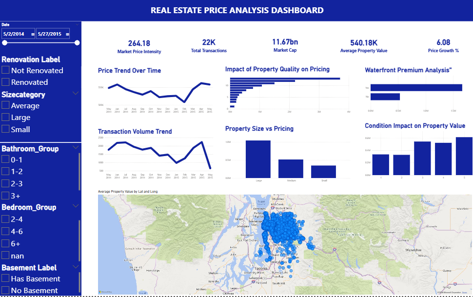

# 🏠 Housing Market Analysis
End-to-end real estate data analysis using Python, SQL, and Power BI to identify pricing drivers like location, size, and amenities. Uncovered trends, outliers, and market patterns through EDA and visualization, enabling data driven pricing and investment decisions.

## 📌 Business Problem  
Real estate pricing is influenced by multiple factors such as location, property size, construction quality, and amenities. However, identifying which factors truly drive price fluctuations is critical for accurate pricing, investment decisions, and market analysis. This project analyzes housing data to uncover key pricing drivers and market behavior.

---

## 🎯 Objective  
- Identify the most influential factors affecting house prices  
- Analyze price variation across locations and features  
- Detect anomalies and outliers in pricing  
- Enable data-driven decision-making  

---

## 🛠 Tools & Their Usage  

### 🔹 Python (Pandas, NumPy, Seaborn, Matplotlib)
- Data cleaning and preprocessing  
- Feature engineering (Price per sqft, House age, Relative size)  
- Exploratory Data Analysis (EDA)  
- Correlation and trend analysis  

### 🔹 SQL  
- Aggregated analysis by location and property features  
- Identification of high-value and low-value clusters  

### 🔹 Power BI  
- Interactive dashboard for market insights  
- KPI tracking (Avg Price, Price per Sqft, Property Distribution)  
- Visual storytelling for decision-making  

---

## 📊 Key Insights  

### 📈 Most Influential Factors (High Impact on Price)
- **sqft_living (Living Area)** → Strongest driver of price (correlation ~0.70+)  
- **grade (Construction Quality)** → Premium pricing for higher-grade properties  
- **location (zipcode / lat-long)** → Significant regional price variation  
- **waterfront & view** → Properties with waterfront show 2–3x higher prices  

---

### 📉 Least Influential Factors
- **bedrooms** → Weak correlation compared to overall area  
- **floors** → Minimal direct pricing impact  
- **year built** → Limited influence unless renovated  

---

### ⚠️ Key Observations
- Larger homes show **diminishing returns** beyond ~3500 sqft  
- Premium locations drive higher prices even for smaller homes  
- Renovated properties consistently outperform non-renovated ones  
- Presence of extreme outliers in luxury housing segment  

---

## 📊 Market Summary  

- **Average Price:** ~$540,000  
- **Median Price:** ~$450,000  
- **Maximum Price:** ~$7,700,000  
- **Minimum Price:** ~$75,000  
- **Average Price per Sqft:** ~$280  

---

## ⚠️ Challenges & Solutions  

### 🔹 Data Quality Issues  
Handled missing values and formatting inconsistencies using Python  

### 🔹 Outliers in Pricing  
Identified using distribution plots and filtered for better analysis  

### 🔹 Feature Impact Analysis  
Used correlation heatmaps and scatter plots to identify key drivers  

---

## 🚀 Business Impact  
- Helps buyers evaluate fair property pricing  
- Assists sellers in optimizing listing prices  
- Enables investors to identify high-growth areas  
- Supports data-driven real estate decision-making  

---

## 📂 Project Structure  
- `Data/` → raw and cleaned datasets  
- `Notebook/` → EDA and preprocessing  
- `SQL_Queries/` → analytical queries  
- `Dashboard/` → Power BI dashboard  
- `Images/` → visual outputs  

---

## 📸 Dashboard Preview  

